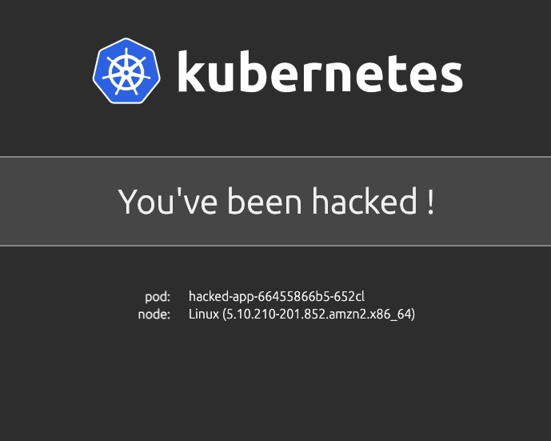

# Webapp you've been hacked


### Purpose

WebApp to demonstrate an application deployment in a hacked environment




### Deployment

```bash
kubectl apply -f https://raw.githubusercontent.com/cleypanw/k8s-you-have-been-hacked-app/main/deployment.yaml 
```


### Deletion

```bash
kubectl delete -f https://raw.githubusercontent.com/cleypanw/k8s-you-have-been-hacked-app/main/deployment.yaml                                                                                     
```